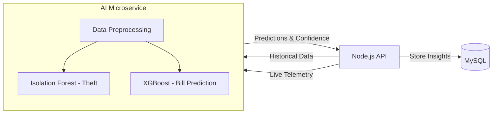

# Artificial Intelligence & Analytics

The PowerGuard AI service is a standalone Python FastAPI application responsible for processing telemetry data to detect anomalies (theft) and predict future billing/demand.

## ML Architecture Flow

## Core Models

1. **Theft Detection (Anomaly Detection)**:
   - Uses `Isolation Forest` to detect statistical outliers in voltage and power factor variance.
   - Evaluates current bypassing and CT reversal patterns.
2. **Bill Prediction (Regression)**:
   - Uses `XGBoost` or `Random Forest` to forecast energy consumption based on historical usage and weather patterns.

## API Integration
The Node.js backend communicates with the Python AI service via internal HTTP requests over Docker's bridge network (`http://ai:8000`). The Node.js server acts as the central coordinator, storing the resulting predictions back into the relational database.
