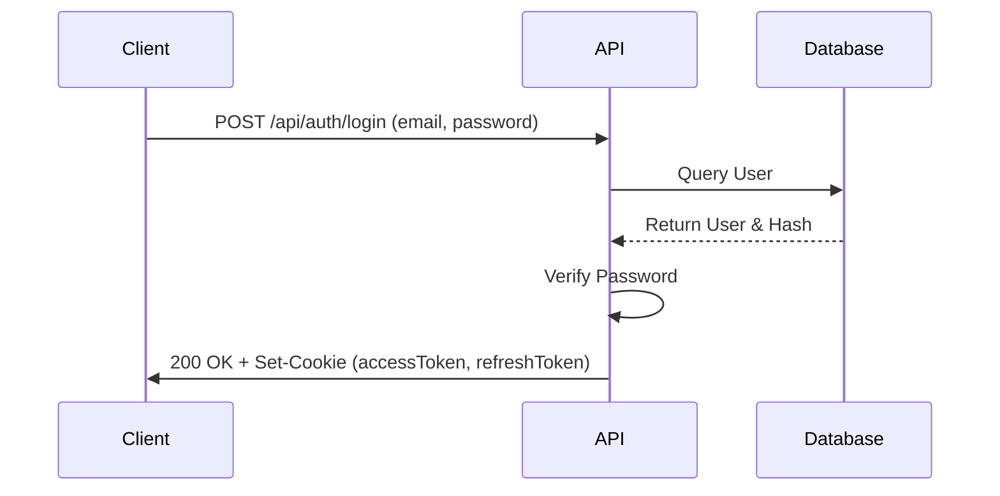

# REST API Documentation

The PowerGuard API provides comprehensive access to the platform's resources. All endpoints (except public authentication routes) require a valid JWT token sent as an `HttpOnly` cookie.

## Authentication Flow

## Core API Endpoints

### 1. Authentication
- `POST /api/auth/login` - Authenticate a user and set cookies.
- `POST /api/auth/register` - Register a new user profile.
- `POST /api/auth/logout` - Clear authentication cookies.

### 2. Meters
- `GET /api/meters` - List all meters (Supports pagination & filtering).
- `GET /api/meters/:id` - Get specific meter details.
- `POST /api/meters` - Register a new meter (Admin only).

### 3. Analytics
- `GET /api/analytics/overview` - Fetch aggregate system statistics.
- `GET /api/analytics/consumer/:id` - Fetch consumer-specific analytics.

### 4. AI Predictions
- `GET /api/ai/predictions/bill` - Get the estimated bill for the current month.
- `GET /api/ai/predictions/theft` - Get theft probability for meters.
