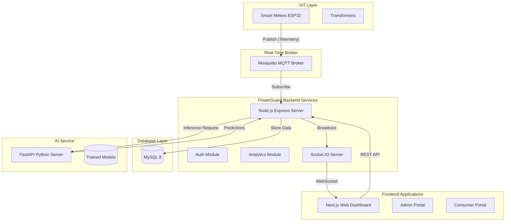

# System Architecture

The PowerGuard platform is built on a modern, decoupled service-oriented architecture tailored for real-time IoT processing and AI analytics.

## Tech Stack Overview

- **Frontend**: Next.js 14, React, Tailwind CSS, shadcn/ui, TanStack Query.
- **Backend API**: Node.js, Express, TypeScript, Prisma ORM.
- **Database**: MySQL 8.
- **Real-time Pipeline**: MQTT (Mosquitto), Socket.IO.
- **AI Analytics**: Python, FastAPI, Scikit-Learn.
- **Deployment**: Docker, Docker Compose, Nginx.

## Architecture Diagram

## Component Architecture

- **Feature-based structure**: The backend is organized by features (e.g., `/modules/auth`, `/modules/meters`). Each contains its own `controller`, `service`, `repository`, `router`, and `types`.
- **Security Middleware**: Global middleware protects all routes utilizing JWT cookies (`HttpOnly`), `helmet`, custom `xss` sanitization, and rate limiting.
- **Cache Strategy**: Frequently accessed, low-volatility data (like user profiles) utilizes an in-memory cache strategy.
