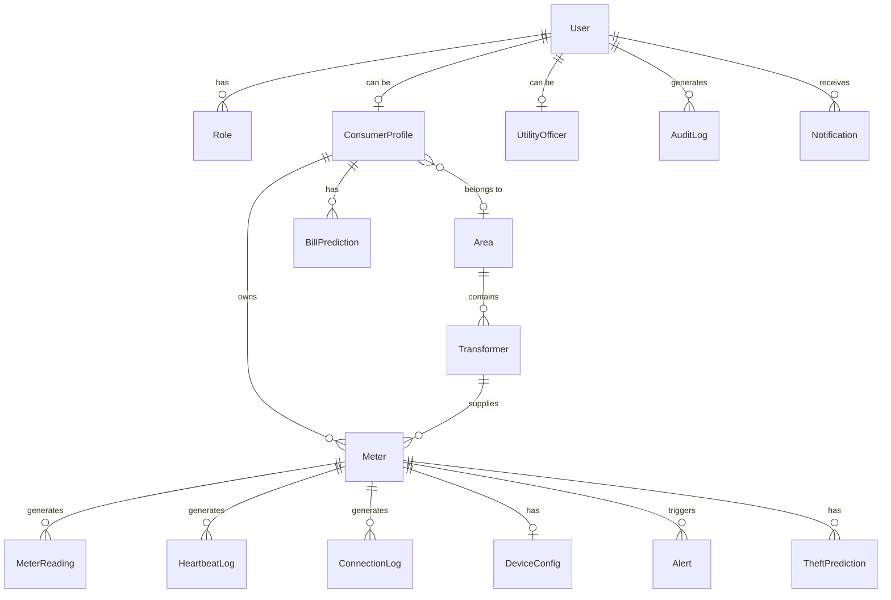

# Database Architecture

PowerGuard utilizes a fully normalized MySQL 8 relational database managed through Prisma ORM. 

## Entity Relationship Diagram

## Core Models

1. **User / RBAC**: Manages authentication (`User`), authorization (`Role`, `Permission`), and security state (account lockouts, tokens).
2. **Profiles**: Separates domain logic into `ConsumerProfile`, `UtilityOfficer`, and `AdminProfile`.
3. **Meters & Grid**: `Area`, `Transformer`, and `Meter` form the hierarchical grid topology.
4. **Telemetry Data**: `MeterReading`, `HeartbeatLog`, and `ConnectionLog` handle the high-velocity IoT data insertion.
5. **Insights & Alerts**: `Alert`, `TheftPrediction`, `BillPrediction` store the output from the AI models and system rules.
6. **Audit**: `AuditLog` provides an immutable history of sensitive administrative actions.
