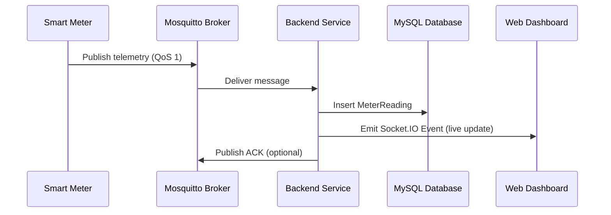

# IoT and MQTT Integration

PowerGuard interfaces with physical hardware (e.g., ESP32 microcontrollers with PZEM-004T sensors) via the MQTT protocol.

## MQTT Data Flow



## Topic Architecture

Meters must publish to specific topics based on their unique `serialNumber`.

| Topic Pattern | Description | Direction |
| --- | --- | --- |
| `meters/+/reading` | Telemetry data (voltage, current, power) | Device -> Cloud |
| `meters/+/status` | Device heartbeats and connection state | Device -> Cloud |
| `meters/+/config` | Configuration updates (polling rates) | Cloud -> Device |

## Payload Specification

### Telemetry (reading)
```json
{
  "serialNumber": "PG-12345",
  "voltage": 230.5,
  "current": 10.2,
  "power": 2345.1,
  "frequency": 50.0,
  "powerFactor": 0.98,
  "timestamp": "2026-08-05T12:00:00Z"
}
```
