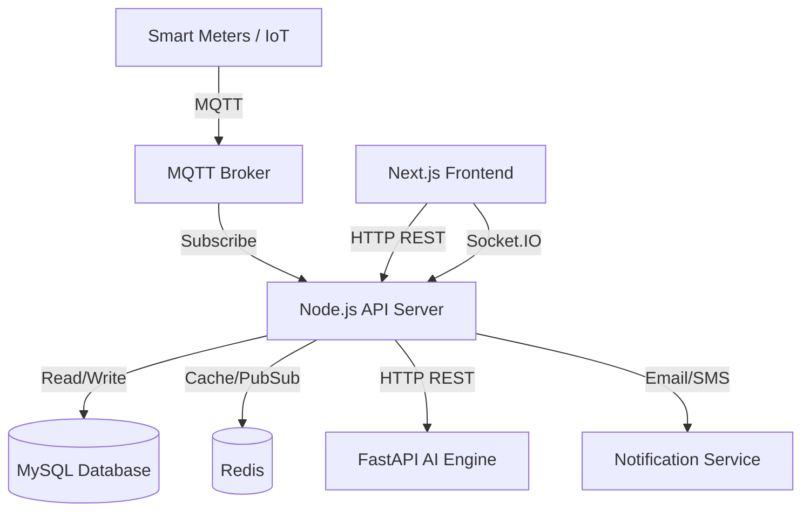

# Architecture Documentation

PowerGuard v1.0.0 utilizes a modern, decoupled microservices architecture optimized for real-time IoT telemetry and heavy AI inference.

## 1. High-Level Architecture

## 2. Core Components

### A. Next.js Frontend (`apps/web`)
- **Framework:** React 19, Next.js 15 (App Router).
- **Styling:** Tailwind CSS, Shadcn UI, Framer Motion.
- **State/Data:** React Query (TanStack), Axios, Socket.IO Client.
- **Role:** Delivers SSR/SSG dashboards for different user roles. Establishes a persistent WebSocket connection for live charts.

### B. Node.js API Server (`apps/server`)
- **Framework:** Express.js, TypeScript.
- **ORM:** Prisma.
- **Responsibilities:**
  - **Auth:** JWT-based stateless authentication and RBAC.
  - **IoT Ingestion:** Subscribes to MQTT topics, processes incoming readings, updates DB.
  - **Real-time Gateway:** Broadcasts processed telemetry and alerts via Socket.IO namespaces (`/readings`, `/alerts`, `/admin`).
  - **Orchestration:** Calls the Python AI engine for inference tasks.

### C. FastAPI AI Engine (`apps/ai`)
- **Framework:** FastAPI, Python 3.10+.
- **Libraries:** scikit-learn, pandas, numpy.
- **Responsibilities:**
  - Hosts pre-trained `.pkl` models.
  - Exposes REST endpoints for Theft Detection (`/api/ai/predict-theft`), Forecasting, and Recommendations.
  - Designed to be scaled independently on GPU/TPU instances if required.

### D. Data Layer
- **MySQL:** Primary persistent store. Relational structure handles complex joins between Consumers, Meters, Transformers, and Readings.
- **Redis:** (Optional/Recommended) Used for Socket.IO adapter scaling, API rate limiting, and caching expensive analytical queries.

## 3. Data Flow: Real-time Telemetry
1. **IoT Device** publishes JSON to `meters/123/reading`.
2. **MQTT Broker** routes the message to the **Node.js Server**.
3. `ReadingProcessor` receives the payload, saves it to **MySQL**.
4. Node.js sends the payload to **FastAPI** for theft detection.
5. If theft is detected, an `Alert` is saved to DB.
6. Node.js emits the reading (and potential alert) via **Socket.IO** to connected clients.
7. **Frontend** receives the event and updates the Recharts graphs seamlessly.
